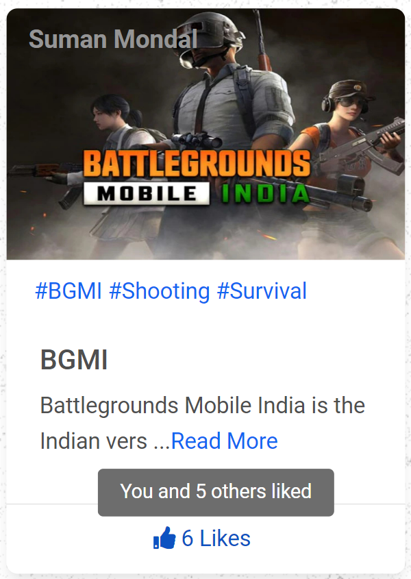
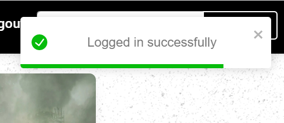
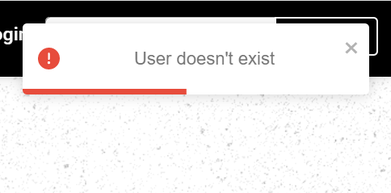

# Game Zone

[Game-Zone](https://game-z-o-n-e.netlify.app/) is the place where gamers can come and share their experience on particular games and also can find the reviews of games that other gamers have shared.

In terms of engineering [Game-Zone](https://game-z-o-n-e.netlify.app/) is a full-stack website built on top of ReactJs with backend support of Express. [Game-Zone](https://game-z-o-n-e.netlify.app/) uses the MongoDB database to store data.

[Game-Zone](https://game-z-o-n-e.netlify.app/) is divided into two parts -

- Client
- Sever

The client part is the front end and the server part is the back end of the project.

# Features

#### Register/Login

Game-Zone is fully secured. Firstly you need to `signup/login` to do anything other than just read the reviews.

### Redirect

A try to access the protected routes will result in a `redirect` to the `login` page. This measure ensures the security of the Game-Zone project.

### 404 Error

A try to access the route which does not exist, a page showing `404 page not found` is represented.

### Home

The above image shows the `home page` when the user successfully `login/signup`.
In the navbar, it shows the name of the user in a color-changing format. The user can like or unlike a review now.

    

 

The user after `login/signup` can `like` or `unlike` a review.

### Read More

Each review contains a read more `link` which redirects to the detailed view of the review.

The above three images show the `read more` page of the BGMI review. The first image shows a big poster of the review.

The second image shows the `username` of the user who created the review, the `duration` from the date the review was created and the description of the review. It also tries to show almost three `related tags` review.

The last image shows a comment section created with the help of `Disqus` where the user can login with `Facebook` `Disqus` `Twitter` or `Google`.

### Add Review

On this page, the user can add a review of any game. The user has to provide the required details to add a review.

Otherwise, an error message to fill up the required field will be shown.

### Dashboard

On the Dashboard page, the user may `delete` the reviews added by the user or may `update` the review.

On clicking the `edit` button, the user will be redirected to the `update` review page where the user can update the existing review.

### Tag Page

On clicking on any `tag` on the review, the user will be redirected to the page where the user can see the reviews related to the tag clicked upon.

### Search

On searching in the search bar for any review it returns all the reviews matching the search keyword.

If `nothing` related to the search is found the website shows a related message.

### Logout

On clicking on the `logout` in the navbar the user gets logout and cannot access protected routes anymore. Game-Zone uses `JSON Web Token (JWT)` which automatically expires after `an hour` the user stop using Game-Zone.

### Toastify

    

 

    

 

Game-Zone uses `toastify` to show related error messages sent by the server part.
